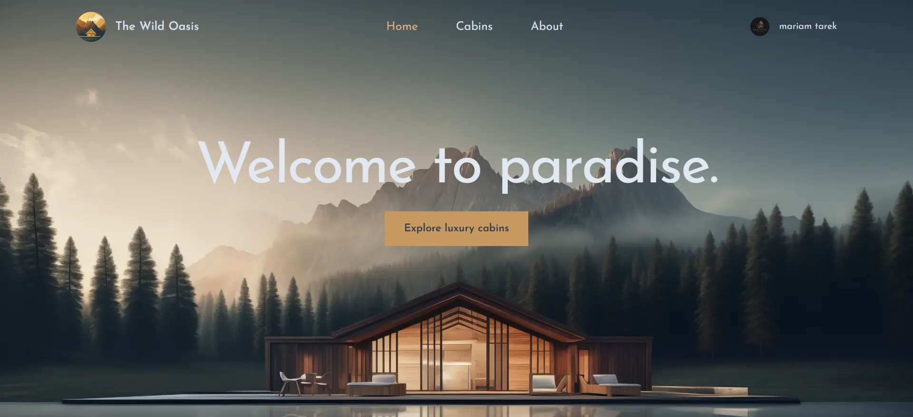
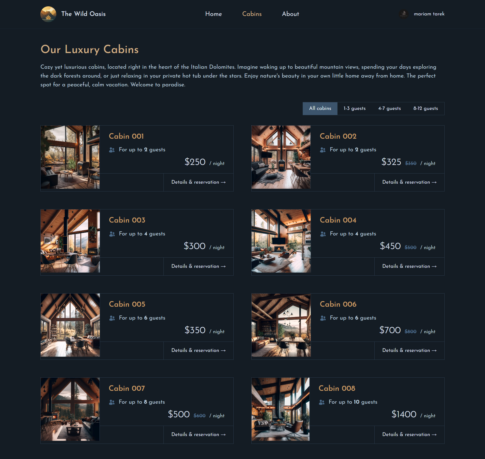
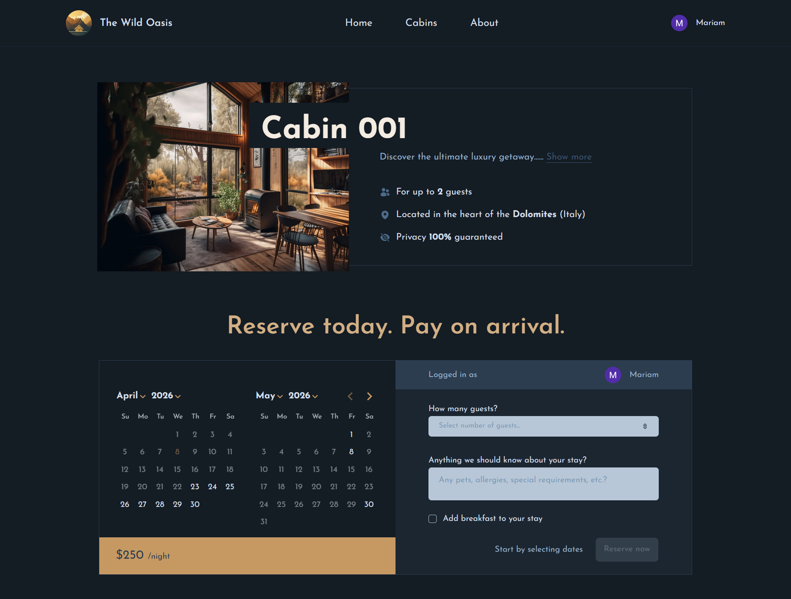
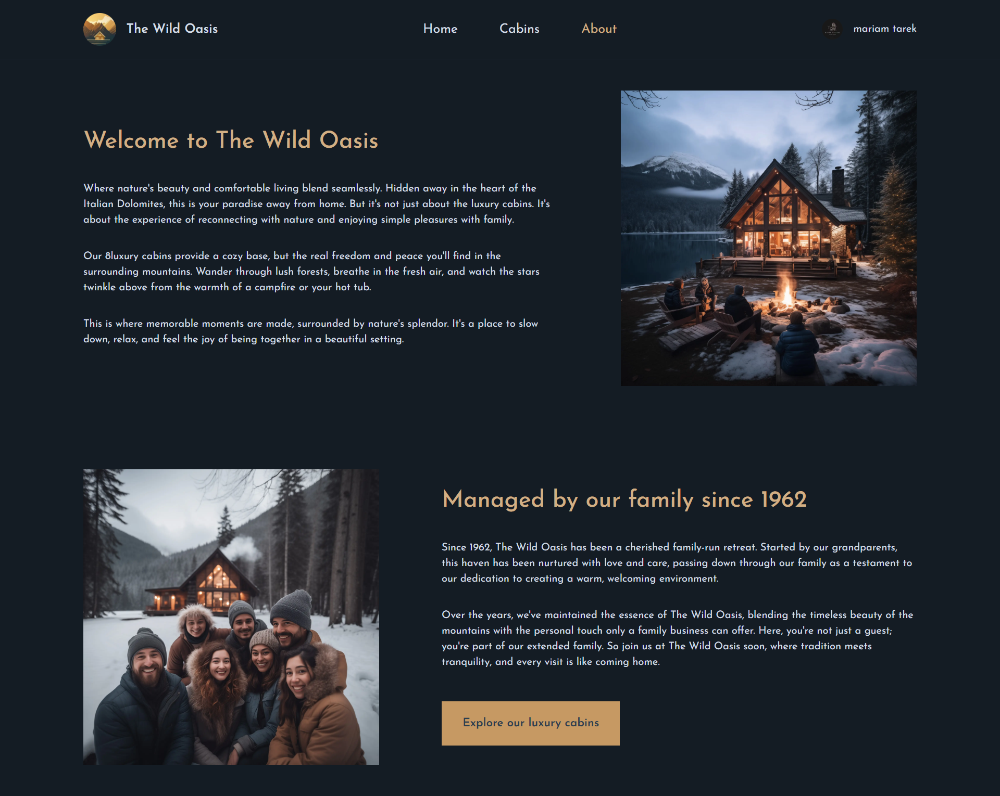
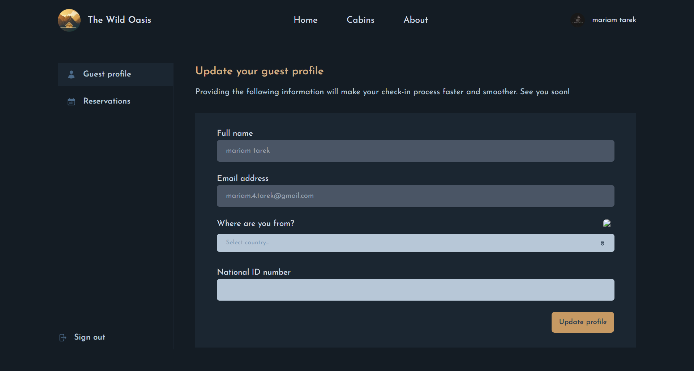
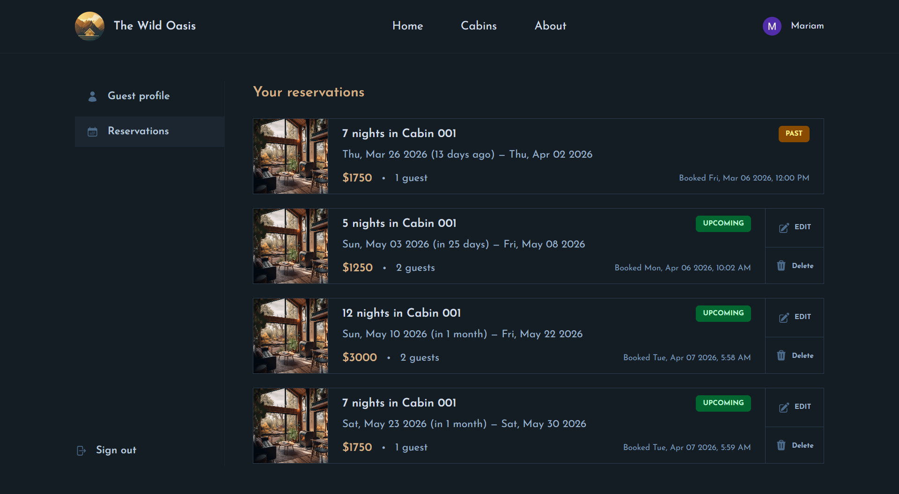

# The wild oasis

## 📋 Overview

A full‑stack cabin booking application that allows users to browse cabins, select available dates, and create reservations with optional services like breakfast. The platform supports authenticated users, role‑based access, and dynamic pricing based on stay duration and settings.

This project is built with a modern Next.js architecture using Server Actions, Prisma ORM, and a PostgreSQL database.

---

## ✨ Features

- Browse available cabins
- Date‑range booking with availability blocking
- Optional breakfast add‑on
- Dynamic price calculation
- User authentication & profile management
- Reservation management (view, edit, cancel)

---

## 📷 Screenshots & Demo

Below are some screenshots showcasing the main features and user flow of the application:

### Home

  
Landing page with a full-screen hero image and a call-to-action to explore available cabins.

### Cabins

  
Displays all cabins with pricing, capacity, and allows filtering by maximum guest capacity. Quick access to individual cabin details.

### Cabin Details

  
Shows detailed cabin information, date selection, price calculation, and optional breakfast.

### About



### Profile

  
Authenticated users can update personal information and manage profile details.

### Reservations

  
Users can view, edit, and manage their upcoming and past reservations.

---

## 🛠️ Tech Stack

### Frontend

- Next.js (App Router)
- React
- Tailwind CSS
- shadcn/ui
- react-hook-form + Zod
- react-day-picker

### Backend

- Next.js Server Actions
- Prisma ORM
- PostgreSQL

---

## 📁 Project Structure (overview)

```text
├── app
├─├── api               # Next.js API routes
│ ├── _assets/ # Images, styles, and static assets
│ ├── _components/ # Shared components
│ │ ├── feedback/ # Spinner and other feedback components
│ │ ├── layout/ # Layout components
│ │ └── ui/ # shadcn/ui components
│ ├── _context/ # React context providers
│ ├── _hooks/ # Custom React hooks
│ ├── _lib/ # Server-side actions, auth, and data service
│ │ ├── actions.js
│ │ ├── auth.js
│ │ └── data-service.js
│ ├── _utils/ # Zod schemas and validation
│ └── page.tsx # Main pages and routes
├── prisma/ # Prisma schema and migrations
│ ├── migrations/
│ └── schema.prisma
├── components/ # (optional extra components if outside app)
├── utils/ # Helper utilities
├── .env.local # Environment variables
├── package.json
└── README.md

```

---

## 🧪 Configure environment variables

Create a `.env` file in the project root (or set these variables in your deployment environment).

```bash
NEXT_PUBLIC_APP_URL=""

# google auth
GOOGLE_CLIENT_ID=""
GOOGLE_CLIENT_SECRET=""

# database
DATABASE_URL=""

# config next auth
NEXTAUTH_URL=http://localhost:3000
NEXTAUTH_URL_INTERNAL=http://localhost:3000
NEXTAUTH_SECRET=""
```

---

## ⚙️ Project Setup

Follow these steps to run the project locally:

### 1- Database Setup

You can create the PostgreSQL database using either:

1- **Prisma Studio / Prisma CLI**  
2- **pgAdmin or any PostgreSQL GUI**

### 2- Clone the repository

```bash
git clone <repository_url>
cd <project_directory>
```

### 3- Install dependencies:

```bash
npm install
```

### 4- Start the development server

```bash
npm run dev
```
